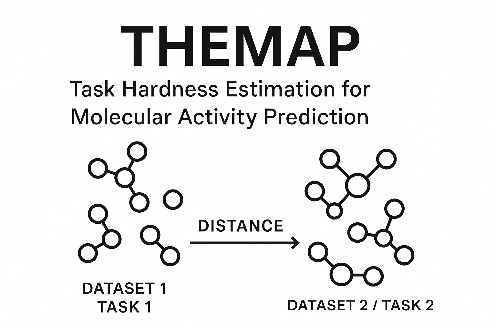

# THEMAP

[](https://doi.org/10.1021/acs.jcim.4c00160)
[](https://www.python.org/downloads/)
[](https://opensource.org/licenses/MIT)
[](https://badge.fury.io/py/themap)

<p align="center">
  
</p>

**T**ask **H**ardness **E**stimation for **M**olecular **A**ctivity **P**rediction

A Python library for calculating distances between chemical datasets to enable intelligent dataset selection for molecular activity prediction tasks.

## Table of Contents

- [Overview](#overview)
- [Installation](#installation)
- [Quick Start](#quick-start)
- [Usage Examples](#usage-examples)
- [Use Cases](#use-cases)
- [Documentation](#documentation)
- [Contributing](#contributing)
- [Citation](#citation)
- [License](#license)

## Overview

THEMAP is a Python library designed to calculate distances between chemical datasets for molecular activity prediction tasks. The primary goal is to enable intelligent dataset selection for:

- **Transfer Learning**: Identify the most relevant source datasets for your target prediction task
- **Domain Adaptation**: Measure dataset similarity to guide model adaptation strategies
- **Task Hardness Assessment**: Quantify how difficult a prediction task will be based on dataset characteristics
- **Dataset Curation**: Select optimal training datasets from large chemical databases like ChEMBL


## Installation

### Prerequisites

- Python 3.10 or higher
- For GPU features: CUDA-compatible GPU and drivers

### Conda Environment (Recommended)

For complete functionality including OTDD and GPU acceleration:

```bash
conda env create -f environment.yml
conda activate themap
pip install -e . --no-deps
```

### Basic Installation

```bash
pip install themap
```

### Development Installation

```bash
git clone https://github.com/HFooladi/THEMAP.git
cd THEMAP
pip install -e .
```

### Feature-Specific Installation

THEMAP offers modular installation options:

```bash
# Full installation with all features
pip install -e ".[all]"

# Specific feature sets
pip install -e ".[ml]"        # Core ML functionality
pip install -e ".[otdd]"      # Optimal transport distances
pip install -e ".[protein]"   # Protein analysis
pip install -e ".[dev]"       # Development tools
pip install -e ".[test]"      # Testing framework
```

### Verify Installation

```bash
python -c "from themap.data.molecule_dataset import MoleculeDataset; print('✅ Core functionality works')"
```

## Quick Start

### Basic Dataset Analysis

```python
import os
from dpu_utils.utils.richpath import RichPath
from themap.data.molecule_dataset import MoleculeDataset

# Load datasets
source_dataset_path = RichPath.create(os.path.join("datasets", "train", "CHEMBL1023359.jsonl.gz"))
source_dataset = MoleculeDataset.load_from_file(source_dataset_path)

# Basic dataset analysis (works with minimal installation)
print(f"Dataset size: {len(source_dataset)}")
print(f"Positive ratio: {source_dataset.get_ratio}")
print(f"Dataset statistics: {source_dataset.get_statistics()}")

# Validate dataset integrity
try:
    source_dataset.validate_dataset_integrity()
    print("✅ Dataset is valid")
except ValueError as e:
    print(f"❌ Dataset validation failed: {e}")
```

### Molecular Embeddings

```python
# Only works with pip install -e ".[ml]" or higher
from themap.data.molecule_dataset import MoleculeDataset
dataset_path = RichPath.create(os.path.join("datasets", "train", "CHEMBL1023359.jsonl.gz"))

# Load dataset
dataset = MoleculeDataset.load_from_file(dataset_path)

# Calculate molecular embeddings (requires ML dependencies)
try:
    features = dataset.get_dataset_embedding("ecfp")
    print(f"Features shape: {features.shape}")
except ImportError:
    print("❌ ML dependencies not installed. Use: pip install -e '.[ml]'")
```

### Distance Calculation

```python
# Only works with pip install -e ".[all]"
from themap.data.tasks import Tasks, Task
from themap.distance.tasks_distance import MoleculeDatasetDistance, ProteinDatasetDistance, TaskDistance

# Create Tasks collection from your datasets
source_dataset_path = RichPath.create(os.path.join("datasets", "train", "CHEMBL1023359.jsonl.gz"))
source_dataset = MoleculeDataset.load_from_file(source_dataset_path)
target_dataset_path = RichPath.create(os.path.join("datasets", "test", "CHEMBL2219358.jsonl.gz"))
target_dataset = MoleculeDataset.load_from_file(target_dataset_path)
source_task = Task(task_id="CHEMBL1023359", molecule_dataset=source_dataset)
target_task = Task(task_id="CHEMBL2219358", molecule_dataset=target_dataset)

# Step 1: Create Tasks collection with train/test split
tasks = Tasks(train_tasks=[source_task], test_tasks=[target_task])

# Step 2: Compute molecule distance with method-specific configuration
try:
    # Use different methods for different data types
    mol_dist = MoleculeDatasetDistance(
        tasks=tasks,
        molecule_method="otdd",     # OTDD for molecules
    )
    mol_dist._compute_features()
    distance = mol_dist.get_distance()
    print(distance)

except ImportError:
    print("❌ Distance calculation dependencies not installed. Use: pip install -e '.[all]'")
```


## Usage Examples

### Transfer Learning Dataset Selection
```python
# Find the most similar training datasets for your target task
candidate_datasets = ["CHEMBL1023359", "CHEMBL2219358", "CHEMBL1243967"]
target_dataset = "my_target_assay"

distances = calculate_all_distances(candidate_datasets, target_dataset)
best_source = min(distances, key=distances.get)  # Closest dataset for transfer learning
```

### Domain Adaptation Assessment
```python
# Assess how much domain shift exists between datasets
domain_gap = calculate_dataset_distance(source_domain, target_domain)
if domain_gap < threshold:
    print("Direct transfer likely to work well")
else:
    print("Domain adaptation strategies recommended")
```

### Task Hardness Prediction
```python
# Predict task difficulty based on dataset characteristics
hardness_score = estimate_task_hardness(dataset, reference_datasets)
print(f"Predicted task difficulty: {hardness_score}")
```

## Reproducing FS-Mol Experiments

Pre-computed molecular embeddings and distance matrices for the FS-Mol dataset are available on [Zenodo](https://zenodo.org/records/10605093).

### Setup
1. Download data from [Zenodo](https://zenodo.org/records/10605093)
2. Extract to `datasets/fsmol_hardness/`
3. Run the provided Jupyter notebooks in the `notebooks/` directory

## Documentation

Full documentation is available at [themap.readthedocs.io](https://hfooladi.github.io/THEMAP/) or can be built locally:

```bash
mkdocs serve  # Serve locally at http://127.0.0.1:8000
```

## Contributing

We welcome contributions! Please see our [Contributing Guidelines](CONTRIBUTING.md) for details.

### Development Setup

```bash
git clone https://github.com/HFooladi/THEMAP.git
cd THEMAP
pip install -e ".[dev,test]"
```

### Running Tests

```bash
pytest
pytest --cov=themap  # with coverage
```

### Code Quality

```bash
ruff check && ruff format  # linting and formatting
mypy themap/               # type checking
```

## Citation

If you use THEMAP in your research, please cite our paper:

```bibtex
@article{fooladi2024quantifying,
  title={Quantifying the hardness of bioactivity prediction tasks for transfer learning},
  author={Fooladi, Hosein and Hirte, Steffen and Kirchmair, Johannes},
  journal={Journal of Chemical Information and Modeling},
  volume={64},
  number={10},
  pages={4031-4046},
  year={2024},
  publisher={ACS Publications}
}
```

## License

This project is licensed under the MIT License - see the [LICENSE](LICENSE) file for details.

## 🤝 Support

 - 📖 [Documentation](https://hfooladi.github.io/THEMAP/)
 - 🐛 [Issue Tracker](https://github.com/HFooladi/THEMAP/issues)
 - 💬 [Discussions](https://github.com/HFooladi/THEMAP/discussions)
---

**Ready to optimize your chemical dataset selection for machine learning?** Start with THEMAP today! 🚀
