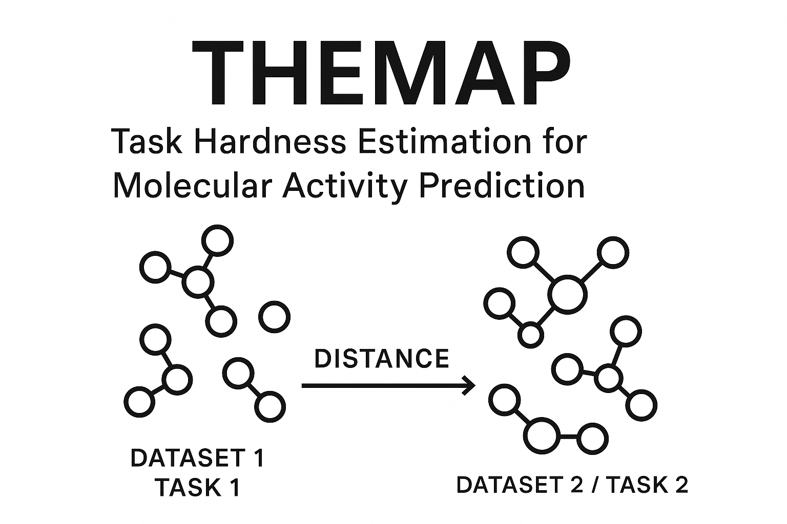

# THEMAP

[](https://doi.org/10.1021/acs.jcim.4c00160)
[](https://www.python.org/downloads/)
[](https://opensource.org/licenses/MIT)
[](https://badge.fury.io/py/themap)

<p align="center">
  
</p>

**T**ask **H**ardness **E**stimation for **M**olecular **A**ctivity **P**rediction

A Python library for calculating distances between chemical datasets to enable intelligent dataset selection for molecular activity prediction tasks.

## Table of Contents

- [Overview](#overview)
- [Installation](#installation)
- [Quick Start](#quick-start)
- [CLI Reference](#cli-reference)
- [Usage Examples](#usage-examples)
- [Reproducing FS-Mol Experiments](#reproducing-fs-mol-experiments)
- [Documentation](#documentation)
- [Contributing](#contributing)
- [Citation](#citation)
- [License](#license)

## Overview

THEMAP is a Python library designed to calculate distances between chemical datasets for molecular activity prediction tasks. The primary goal is to enable intelligent dataset selection for:

- **Transfer Learning**: Identify the most relevant source datasets for your target prediction task
- **Domain Adaptation**: Measure dataset similarity to guide model adaptation strategies
- **Task Hardness Assessment**: Quantify how difficult a prediction task will be based on dataset characteristics
- **Dataset Curation**: Select optimal training datasets from large chemical databases like ChEMBL


## Installation

### Quick Start (Recommended)

The easiest way to install THEMAP with all features:

```bash
git clone https://github.com/HFooladi/THEMAP.git
cd THEMAP
source install.sh
```

This automatically:
- Installs `uv` (fast Python package manager) if needed
- Creates a virtual environment in `.venv`
- Installs all dependencies
- Activates the environment

After installation, try an example:
```bash
python examples/quickstart.py
```

To reactivate the environment later:
```bash
source .venv/bin/activate
```

### Manual Installation

For more control, install with pip:

```bash
pip install themap                # Basic installation from PyPI
pip install -e ".[all]"           # Full installation (editable)
pip install -e ".[protein]"       # Protein analysis only
pip install -e ".[otdd]"          # Optimal transport only
pip install -e ".[dev,test]"      # Development + testing
```

### Conda Alternative

For GPU support with specific CUDA versions:

```bash
conda env create -f environment.yml
conda activate themap
pip install -e . --no-deps
```

### Prerequisites

- Python 3.10 or higher
- For GPU features: CUDA-compatible GPU and drivers

## Quick Start

### Compute Dataset Distances

The simplest way to compute distances between molecular datasets:

```python
from themap import quick_distance

results = quick_distance(
    data_dir="datasets",          # Directory with train/ and test/ folders
    output_dir="output",          # Where to save results
    molecule_featurizer="ecfp",   # Fingerprint type (ecfp, maccs, etc.)
    molecule_method="euclidean",  # Distance metric
)

# Results saved to output/molecule_distances.csv
```

### Using a Config File

For reproducible experiments, use a YAML configuration:

```python
from themap import run_pipeline

results = run_pipeline("config.yaml")
```

Example `config.yaml`:
```yaml
data:
  directory: "datasets"

distances:
  molecule:
    enabled: true
    featurizer: "ecfp"
    method: "euclidean"

output:
  directory: "output"
  format: "csv"
```

### Data Format

Organize your data in this structure:

```
datasets/
├── train/                        # Source datasets
│   ├── CHEMBL123456.jsonl.gz
│   └── ...
└── test/                         # Target datasets
    ├── CHEMBL111111.jsonl.gz
    └── ...
```

Each `.jsonl.gz` file contains molecules in JSON lines format:
```json
{"SMILES": "CCO", "Property": 1}
{"SMILES": "CCCO", "Property": 0}
```


## CLI Reference

THEMAP provides a command-line interface for all core operations. After installation, the `themap` command is available in your terminal.

```bash
themap --help              # Show all available commands
themap <command> --help    # Show help for a specific command
```

### Quick Distance Computation

Compute distances between datasets with minimal setup — no config file needed:

```bash
themap quick datasets/ -f ecfp -m euclidean -o output/
themap quick datasets/ -f maccs -m cosine -j 4
```

### Full Pipeline with Config File

For reproducible experiments, use a YAML configuration:

```bash
themap init                              # Generate a config.yaml template
themap run config.yaml                   # Run the full pipeline
themap run config.yaml -o results/       # Custom output directory
themap run config.yaml --molecule-only   # Skip protein distances
themap run config.yaml -j 4             # Set parallel workers
```

### Pre-compute Features

Featurize datasets and cache to disk (useful before running multiple distance computations):

```bash
# Single featurizer
themap featurize datasets/ -f ecfp

# Multiple featurizers at once
themap featurize datasets/ -f ecfp -f maccs -f desc2D

# Featurize a specific fold or file
themap featurize datasets/ -f ecfp --fold train
themap featurize datasets/test/CHEMBL123.jsonl.gz -f ecfp

# Force recompute (ignore cached features)
themap featurize datasets/ -f ecfp --force
```

### Data Utilities

```bash
# Convert CSV to THEMAP's JSONL.GZ format
themap convert data.csv CHEMBL123456
themap convert data.csv CHEMBL123456 --smiles-column SMILES --activity-column pIC50

# Inspect a dataset directory
themap info datasets/

# List all available featurizers (27 molecule + 5 protein featurizers)
themap list-featurizers
```

Add `-v` before any command for verbose/debug output: `themap -v quick datasets/`

## Usage Examples

### Analyzing Distance Results

```python
import pandas as pd

# Load computed distances
distances = pd.read_csv("output/molecule_distances.csv", index_col=0)

# Find closest source for each target (transfer learning selection)
for target in distances.columns:
    closest = distances[target].idxmin()
    dist = distances[target].min()
    print(f"{target} <- {closest} (distance: {dist:.4f})")

# Estimate task hardness (average distance to k-nearest sources)
k = 3
for target in distances.columns:
    hardness = distances[target].nsmallest(k).mean()
    print(f"Task hardness for {target}: {hardness:.4f}")
```

## Reproducing FS-Mol Experiments

The companion data for our paper *"Quantifying the hardness of bioactivity prediction tasks for transfer learning"* (J. Chem. Inf. Model. 64(10), 4031–4046, 2024) is published on [Zenodo (record 10605093)](https://zenodo.org/records/10605093). It contains pre-computed OTDD distance matrices across multiple molecular featurizers, ESM-2 protein embeddings, internal chemical hardness measures, and ProtoNet evaluation summaries on the FS-Mol benchmark — everything needed to reproduce the figures and tables without re-running the expensive embedding pipelines.

### 1. Install dependencies

```bash
source install.sh    # creates .venv and installs themap[all,dev,test]
```

The reproduction notebooks rely on the optional `ml` extras (torch, ESM, etc.); the all-in-one install above covers them.

### 2. Download the dataset (~16 GB)

You need ~35 GB of free disk space (16 GB zip + ~16 GB extracted). The script downloads with resume support, verifies the MD5 checksum, extracts into `datasets/fsmol_hardness/`, and removes the zip when done.

```bash
make download-fsmol
# or, equivalently:
python scripts/download_fsmol_data.py
```

Useful flags: `--keep-zip` (don't delete the archive after extraction), `--force` (re-download), `--no-verify` (skip MD5 — only if you've already verified out-of-band), `--dest DIR` (custom location).

After it completes you should see:

```
datasets/fsmol_hardness/
├── ext_chem/                  # OTDD distance matrices per featurizer
├── ext_prot/                  # ESM-2 protein embeddings (t6_8M ... t36_3B)
├── int_chem/{train,test}/     # Internal chemical hardness (RF baselines)
└── FSMol_Eval_ProtoNet/summary/   # ProtoNet performance per support-set size
```

<details>
<summary>Manual download (no Python)</summary>

```bash
mkdir -p datasets/fsmol_hardness
cd datasets
wget -c https://zenodo.org/records/10605093/files/fsmol_hardness.zip
echo "10644660a53d8d106b6883cb53eb1f3b  fsmol_hardness.zip" | md5sum -c -
unzip fsmol_hardness.zip -d fsmol_hardness/
```
</details>

### 3. Run the reproduction notebooks

```bash
cd notebooks
jupyter lab        # or: jupyter notebook
```

| Notebook | What it reproduces |
| --- | --- |
| [`external_chemical_hardness.ipynb`](notebooks/external_chemical_hardness.ipynb) | External chemical-space hardness: correlation between k-nearest source-task OTDD distance and ProtoNet performance, across molecular featurizers (GIN, UniMol, ChemBERTa/Roberta-Zinc, desc2D). |
| [`external_protein_hardness.ipynb`](notebooks/external_protein_hardness.ipynb) | External protein-space hardness: correlation between target/source protein-embedding distance and performance, across ESM-2 model sizes (t6\_8M → t36\_3B). |
| [`task_hardness.ipynb`](notebooks/task_hardness.ipynb) | Combined task-hardness score (external chemical + external protein + internal chemical) and its correlation with ProtoNet performance at support-set sizes 16/32/64/128. |

Notebook paths are resolved relative to the `notebooks/` directory, so launch Jupyter from there. Outputs are auto-stripped on commit by the pre-commit hook (`nbstripout`).

## Documentation

Full documentation is available at [hfooladi.github.io/THEMAP](https://hfooladi.github.io/THEMAP/) or can be built locally:

```bash
mkdocs serve  # Serve locally at http://127.0.0.1:8000
```

## Contributing

We welcome contributions! Please see our [Contributing Guidelines](CONTRIBUTING.md) for details.

### Development Setup

```bash
git clone https://github.com/HFooladi/THEMAP.git
cd THEMAP
source install.sh           # creates .venv and installs all deps
```

Or manually:
```bash
pip install -e ".[dev,test,ml]"
pre-commit install   # one-time; install.sh does this automatically
```

### Running Tests

```bash
source .venv/bin/activate    # always activate venv first
python run_tests.py          # all tests
python run_tests.py fast     # skip slow tests
python run_tests.py coverage # with coverage
pytest -k "test_name"        # specific test by name
```

### Code Quality

```bash
ruff check .                 # linting
ruff format .                # formatting
mypy -p themap               # type checking
```

## Citation

If you use THEMAP in your research, please cite our paper:

```bibtex
@article{fooladi2024quantifying,
  title={Quantifying the hardness of bioactivity prediction tasks for transfer learning},
  author={Fooladi, Hosein and Hirte, Steffen and Kirchmair, Johannes},
  journal={Journal of Chemical Information and Modeling},
  volume={64},
  number={10},
  pages={4031-4046},
  year={2024},
  publisher={ACS Publications}
}
```

## License

This project is licensed under the MIT License - see the [LICENSE](LICENSE) file for details.

## Support

- [Documentation](https://hfooladi.github.io/THEMAP/)
- [Issue Tracker](https://github.com/HFooladi/THEMAP/issues)
- [Discussions](https://github.com/HFooladi/THEMAP/discussions)
