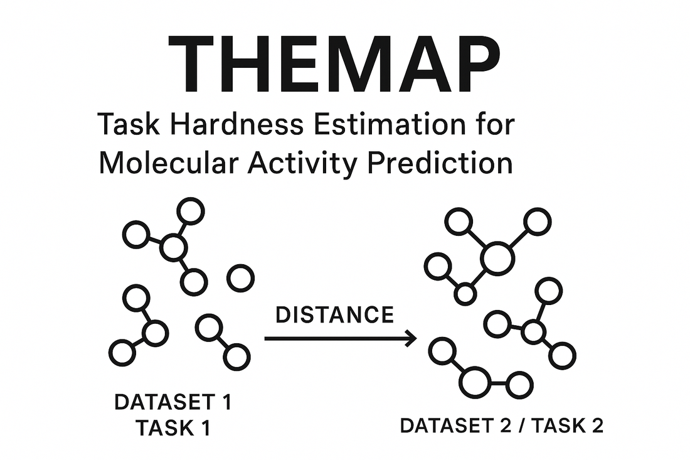

# THEMAP: Task Hardness Estimation for Molecular Activity Prediction

[](https://doi.org/10.1021/acs.jcim.4c00160)
[](https://www.python.org/downloads/)
[](https://opensource.org/licenses/MIT)
[](https://pypi.org/project/themap/)

<p align="center">
  
</p>

**THEMAP** is a Python library for computing distances between chemical datasets and estimating task hardness for bioactivity prediction. It helps researchers identify similar tasks for transfer learning and quantify prediction difficulty.

<div class="grid cards" markdown>

-   :material-rocket-launch-outline: **Quick Start**

    ---

    Get up and running with THEMAP in minutes

    [:octicons-arrow-right-24: Getting started](user-guide/getting-started.md)

-   :material-book-open-variant: **Tutorials**

    ---

    Step-by-step guides for common workflows

    [:octicons-arrow-right-24: View tutorials](tutorials/index.md)

-   :material-code-braces: **API Reference**

    ---

    Detailed documentation for all modules

    [:octicons-arrow-right-24: API docs](api/distance.md)

</div>

## Key Features

- **Multi-modal distance computation**: Molecular (OTDD, Euclidean, Cosine), protein (ESM2 embeddings), and metadata distances
- **27 molecular featurizers**: Fingerprints, descriptors, and neural embeddings
- **Production-ready**: Caching, parallel processing, GPU acceleration
- **CLI and Python API**: Use from the command line or programmatically
- **Unified Task system**: Molecules, proteins, and metadata in one framework

## Installation

```bash
# From PyPI (recommended)
pip install themap

# With all optional dependencies (ML, protein, OTDD)
pip install "themap[all]"
```

To install from source for development:

```bash
git clone https://github.com/HFooladi/THEMAP.git
cd THEMAP
source install.sh   # uv-based; creates .venv and installs dev extras
```

See [Getting Started](user-guide/getting-started.md) for the optional dependency groups.

## Quick Examples

### Command Line

```bash
# Compute distances between datasets
themap quick datasets/ -f ecfp -m euclidean -o output/

# Full pipeline with config file
themap run config.yaml
```

### Python One-Liner

```python
from themap import quick_distance

results = quick_distance(
    data_dir="datasets",
    output_dir="output",
    molecule_featurizer="ecfp",
    molecule_method="euclidean",
)
# Results saved to output/molecule_distances.csv
```

### Programmatic API

```python
from themap import DatasetDistance, DatasetLoader

# Load datasets
loader = DatasetLoader("datasets/")
train_datasets = loader.load_fold("train")
test_datasets = loader.load_fold("test")

# Compute distance matrix
dd = DatasetDistance(
    train_datasets=train_datasets,
    test_datasets=test_datasets,
    featurizer="ecfp",
    method="euclidean",
)
distance_matrix = dd.compute()
```

## Performance

| Method | Speed | Memory | Best For |
|--------|-------|--------|----------|
| **OTDD** | Slower | High | Small-medium datasets, highest accuracy |
| **Euclidean** | Fast | Low | Large datasets |
| **Cosine** | Fast | Low | High-dimensional features |

## Citation

If you use THEMAP in your research, please cite:

```bibtex
@article{fooladi2024quantifying,
  title={Quantifying the hardness of bioactivity prediction tasks for transfer learning},
  author={Fooladi, Hosein and Hirte, Steffen and Kirchmair, Johannes},
  journal={Journal of Chemical Information and Modeling},
  volume={64},
  number={10},
  pages={4031-4046},
  year={2024},
  publisher={ACS Publications}
}
```

## License

THEMAP is released under the MIT License. See [LICENSE](https://github.com/HFooladi/THEMAP/blob/main/LICENSE) for details.
